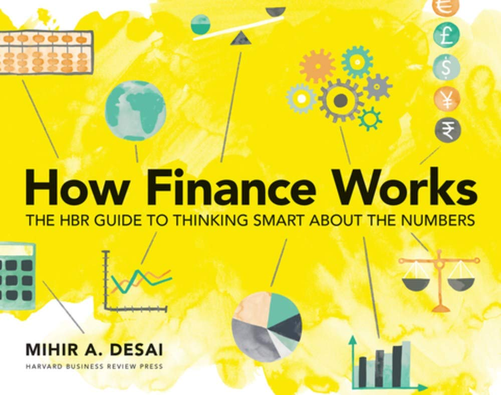
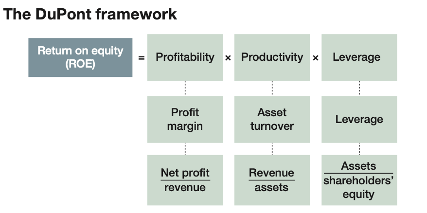

## Financial Analysis

Large cash holdings can generally be understood as (a) an insurance policy during uncertain times, (b) a war chest for making future acquisitions, or (c) a manifestation of the absense of investment opportunities.

Companies invest much of their cash in government securities that can quickly be turned into cash - so-called **marketable securities**.

**Accounts receivable** are amounts that a company expects to receive from its customers in the future. As trust grows in a relationship between a company and its customers, the company might be willing to allow customers to pay later.

**Inventories** are the goods (or the inputs that become those goods) that a company intends to sell.

**"Property, plant, and equipment" (PP&E)** is the term for the tangible, long term asset that a company uses to produce or distribute its product.

**Other assets** can mean many things, but are likely to be intagible assets - things like patents and brands. When a company acquires another company for more that the value of its assets on their balance sheet, that difference is typically recorded on the acquiring company's balance sheets as **goodwill**.

**Liabilities** represents those amounts financed by lenders to whom the company owes amounts; shareholders' equity, or net worth, curresponds to the funds that shareholders provide.

**Accounts payable** represent amounts due to others, often over a short time, and typically tothe company's suppliers.

Sometimes firms may have **notes payable**, a short term financial obligations.

**Accrued items** broadly represent amounts due to others for activites already delivered. One example is salaries.

Unlike other liabilities, **debt** is distinctive because it has an explicit interest rate.

**Shareholders' equity** represents an ownership claim with variable returns - in effect, the owners get all residual cash from the business after costs and liabilities.

**Preferred stock** is often called a hybrid instrument because it combines elements of both debt and equity claims. Like debt, a preferred dividend can be fixed and paid before common stock dividends, but like equity, preferred stock is associated with ownership and is paid after debt in the even of bankruptcy.

**Ratios** make numbers meaningful by providing comparability across companies and through time.

**Liquidity** refers to the ability of a company to generate cash quickly. If all your assets are in real estate, you are illiquid. And if all your wealth is in your checking account, you're highly liquid.

Most companies go bankrupt because they run out of cash. **Liquidity ratios** measure this risk by emphasizing the company's ability to meet short-term obligations with assets that can quickly be converted into cash.

**Profit Margin** = Net profit / revenue

**Gross profit** only subtracts the expenses related to the production of goods from revenue, while **operating profit** also subtracts other operating costs, such as selling and administrative costs. **Net profit** also subtracts interest and tax expenses from operating profit.

**Return on Equity (ROE)** = Net profit / shareholders' equity
(ROE measures the annual return that shareholders earn.)

**EBITDA Margin** = EBITDA / revenue
EBIT is operating profit (earnings before interest and taxes)
Since some companies have different tax burdens and capital structures, EBIT provides a way to compare their performance more directly.
DA stands for "depriciation and amortization." Depreciation refers to how physical assets, such as vechicles and equipment, lose value over time, and amortization refers to that same phenomenon, but for intangible assets.

Just as lever lets you move rock your couldn't otherwise move, leverage in finance allows owners to control assets they couldn't control otherwise. Managing leverage is critical because it enables you to do things you couldn't otherwise do and because it magnifies your returns - in both directions.
**Debt to assets** = Total debt / total assets
Measures the proportion of all assets financed by debt. It provides a balance sheet perspective on leverage.

**Debt to Capitalization** = Debt / debt + shareholders’ equity
The ratio of long-term debt to capitalization provides a somewhat more subtle measure of leverage by emphasizing the mix of debt and equity. The denominator in this ratio is capitalization—the combination of a company’s debt and equity.

**Assets to Shareholders’ Equity** = Assets / shareholders’ equity
This ratio tells us precisely how many more assets an owner can control relative to their own equity capital.

**Interest Coverage Ratio** = EBIT / interest expense
Measures a company’s ability to fund inter- est payments from its operations and uses only data from the income statement.

**Productivity ratios** measure how well a company utilizes its assets to produce outputs. Over the long run, increases in productiv- ity are the most important contributor to economic growth.

**Asset Turnover** = Revenue / total assets
This ratio measures how effectively a company is using its as- sets to generate revenue.

**Inventory Turnover** = Cost of goods sold / inventory
Inventory turnover measures how many times a company turns over or sells all its inventory in a given year.

**Days Inventory** = 365 / inventory turnover
Provides the average number of days a piece of inventory is kept inside a company before it is sold.

**Receivables Collection Period** = 365 / (sales / receivables)
The lower this figure, the faster a company is getting cash from its sales.

**The DuPont framework** breaks ROE algebraically into three ingredients: profitability, productivity, and leverage.

If shareholders bear more risk, they're going to deman a higer return. So capital markets and the competition across companies drive returns to shareholders together and risk drives them apart.

**Return on capital** = EBIAT / (debt + equity)
It considers both capital providers and their combined return.

## The Finance Perspective

Cash is the most important. Your capacity to transform your business into cash that you can use to finance your activities, repay your debt or distribute to your shareholders is the key.

**EBIT Equation** = Net profit + interest + taxes
Operating profit gives a clearer view of how efficient and profitable a company is relative to new profit.

**EBITDA Equation** = Net profit + interest + taxes + depreciation and amortization

**Operating Cash Flow Equation** = Net profit + depreciation and amortization - increases in accounts receivable - increases in inventory + increases in unearned revenue + increases in accounts payable
It considers the costs of working capital, and it accounts for tax and interest paymetns by beginning with net profit.

**Working capital** = current assets - current liabilities

The equation for calculating free cash flow provides a measure of the amount of cash flows truly unencumbered by the operations of a business.
[free cash flow](./free-cash-flow.png)

Every time you have to wait a year, you "haircut" future cash flows by one plus the interest rate, because that's what you would have earned if you hadn't had to wait.
**Discounting Formula**: Cash flow / (1 + r)
r = discount rate, the interest you could receive by making that relevant alternative investment.

The present value of any investment is the sum of all future cash flows discounted back to the present using an appropriate discount rate.

The emphasis on cash explains why companies that generate profits but no cash might be unsustainable and why companies that generate no profits but lots of cahs might be valuable.
Cash earned today is more valuable than cahs earned tomorrow because of the opportunity cost of capital.

## The Financial Ecosystem

The analyst's job is to value companies by creating forecasts and then make recommendations to investors.

Exchange of information is one of the first key insights about capital markets - often, their interactions take the form of trades, and these trades may not only be in capital. Often, these trades are for information or knowledge.

Institutional investors are simply entities that invest large amounts of capital on behalf of others and allocate it in ways that feel will best support their clients.

**Mutual Funds** manage money on behalf of individuals and invest those funds in diversified portfolios of stocks and bonds.

**Pension Funds** are large pools of money that represent the retirement assets of workers from a particular company, union, or government entity.

**Foundations and endowment funds**. Not-for-profit foun- dations and organizations sometimes retain and invest funds over long periods to create more stability for their operations.

**Sovereign wealth funds**. Countries with excess savings often invest those savings through a sovereign wealth funds.

**Hedge funds** are similar to mutual funds, they are differentiated by their lower level of regulations and use of leverage and their different approach to managing risk.

"Going log" means you buy the stock.
To short a company's stock, you borrow shares from another investor, such as mutual fund, that charges fee for lending the shares to you. Once you’ve bor- rowed the shares, you sell them. At some point in the future, you buy back the shares (hopefully at a lower price) and return them to the institutional investor whom you borrowed the shares from.

*Traders* make money largely from the gap known as the bid-ask spread.

*Salespeople* sell financial instruments to investors on the buy side

*Investment bankers* work with companies that either want to raise the capital or want to buy or sell operating assets.
